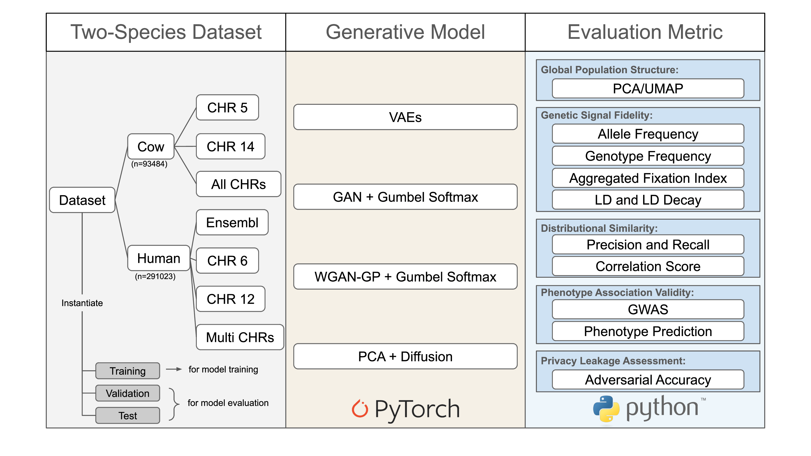

# Deep Generative Models for Synthetic Discrete Genotype Simulation

This repository accompanies the paper:  
**_Deep Generative Models for Discrete Genotype Simulation_**  


## 🔍 Overview

This project implements several deep generative models—including Variational Autoencoders (VAEs), Generative Adversarial Networks (GANs), Wasserstein GANs (WGANs), and Diffusion Models—to simulate synthetic genotype data. We propose model adaptations specifically tailored to the discrete nature of genotype representation and evaluate them across multiple metrics rooted in both quantitative genetics and deep learning.




## 🧬 Datasets

- **Cow Cohort**  
  - 93484 Holstein cows  
  - 50161 SNPs across 29 pairs of autosomal chromosomes  
  - Phenotype: Fat content (FC), represented by Yield Deviation (YD)

- **Human Cohort**  
  - Subsets derived from the [UK Biobank](https://www.ukbiobank.ac.uk/)  
  - Used to test the scalability and generalizability of generative models across species and population groups 
  - Phenotypes: Height and Sex


## 🚀 Installation and Reproducing Experiments

1. Clone the repository:
   ```bash
   git clone https://github.com/SihanXXX/DiscreteGenoGen.git
   cd DiscreteGenoGen
   ```
   
2. Install the dependencies:
   ```bash
   pip install -r requirements.txt
   ```
   
3. We strongly recommend you starting with the notebooks in the [demo](./demo) folder. These allow you to use pre-trained generative models to simulate genotype data and compute evaluation metrics.

4. Once you have generated synthetic genotype data, you can try to train generative models from scratch using the corresponding scripts in the [models](./models) directory.


## 📦 Repository Structure

```bash
.
├── demo/                   # Demo notebooks to replicate our experiments result (recommended starting point)
├── figure_data/            # Intermediate data used to generate the figures in the manuscript
├── metadata/               # SNP informations and phenotype example
├── metric/                 # Implementation of evaluation metrics for synthetic genotype data
├── metric_analysis_result/ # Analysis results of metric behavior and robustness
├── models/                 # Model architectures and training code
├── pca/                    # PCA results used as latent representation for diffusion models
├── pheno_prediction/       # Predictive Models for Genotype-to-Phenotype Prediction
├── GenSNP_schema.png   
├── LICENSE
├── README.md    
├── requirements.txt    
